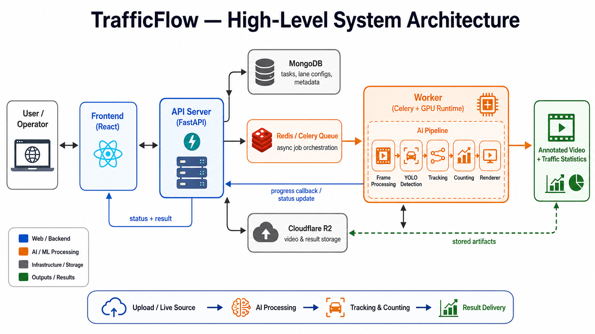
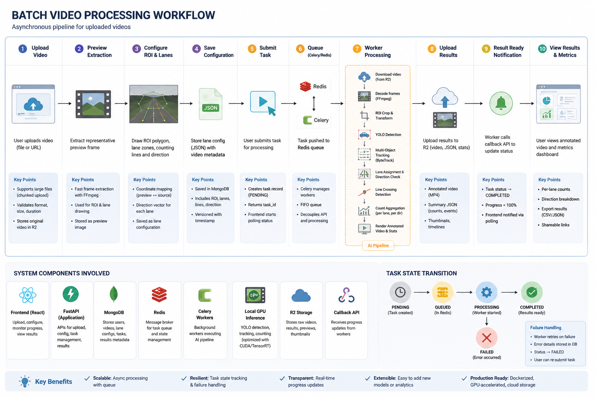
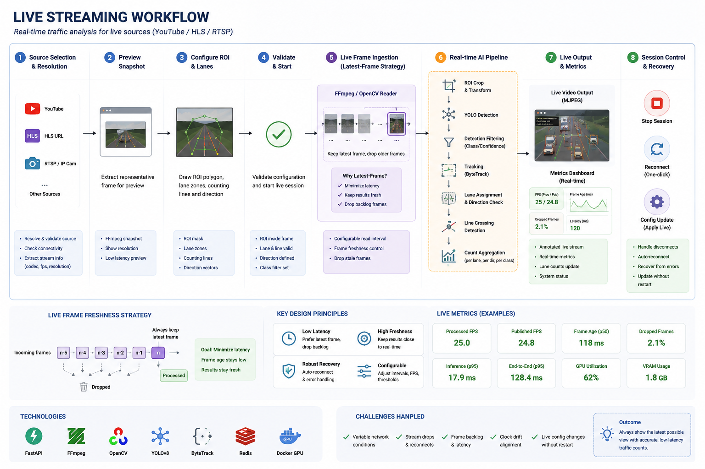
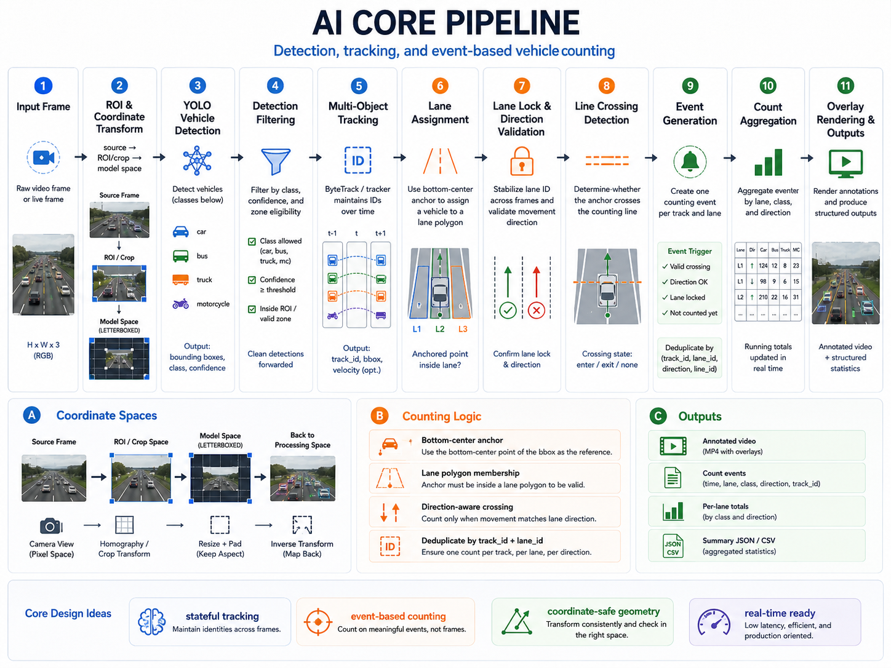
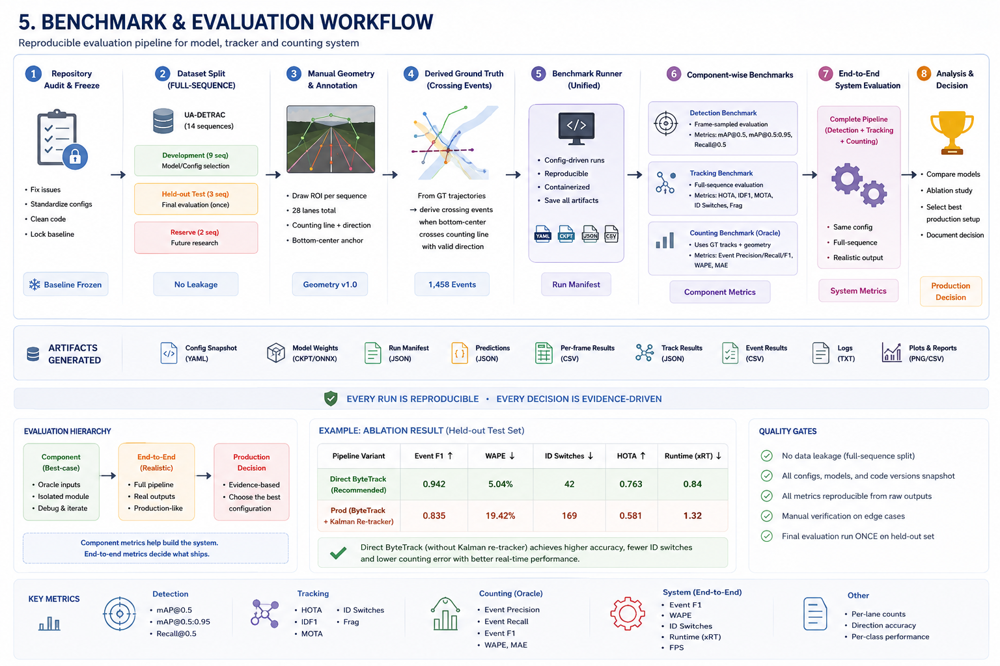
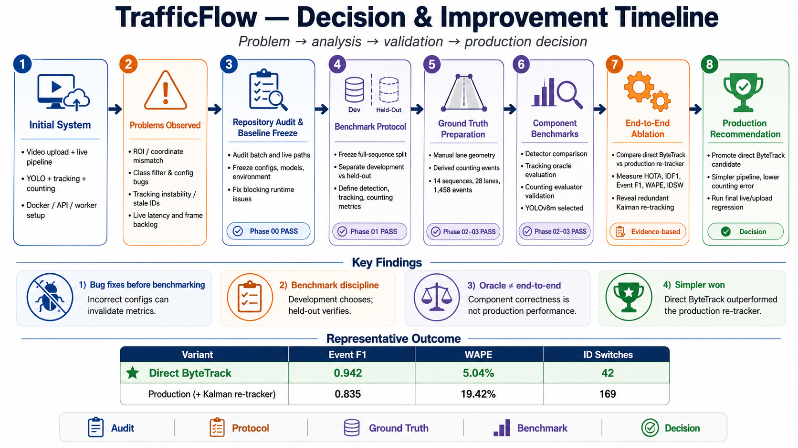

# TrafficFlow

Hệ thống phân tích giao thông bằng video: phát hiện, theo dõi và đếm xe theo từng làn đường. Người dùng upload video giao thông hoặc kết nối luồng trực tiếp (YouTube/HLS), vẽ vùng giám sát — hệ thống tự động trả về video có overlay và bảng thống kê số lượng xe theo làn, loại xe và hướng di chuyển.

Dự án nhóm 5 thành viên, triển khai qua Docker với GPU local.

---

## Kiến trúc hệ thống



```
Người dùng / Frontend
  → FastAPI API
    → MongoDB (lưu task, config, kết quả)
    → Redis / Celery (hàng đợi xử lý)
      → Worker (tải video, gọi AI engine)
        → Local GPU Inference (YOLO + ByteTrack + Counting)
          → Cloudflare R2 (lưu video kết quả)
            → Trả kết quả về Frontend
```

---

## Tính năng chính

- **Upload video** giao thông (hỗ trợ chunked upload cho file lớn, tự động chuẩn hóa 1080p)
- **Live streaming** từ YouTube, HLS, RTSP hoặc MJPEG — phân tích thời gian thực
- **Vẽ trực quan** vùng giám sát (ROI), làn đường, đường đếm và hướng xe ngay trên giao diện web
- **AI Pipeline**: YOLO phát hiện xe → ByteTrack theo dõi → Lọc theo làn → Đếm xe qua vạch
- **Dashboard** thống kê: số lượng xe theo làn, loại xe (car, bus, truck, motorcycle) và hướng
- **GPU acceleration** local qua Docker — không phụ thuộc cloud GPU

---

## Workflow — Xử lý video upload



```text
Upload video → Trích xuất frame preview
  → Người dùng vẽ ROI + làn đường + đường đếm + hướng
    → Lưu lane config → Submit task
      → Hàng đợi Celery → Worker tải video
        → Xử lý từng frame: Detect → Track → Count → Render
          → Upload kết quả lên R2
            → Frontend poll kết quả: video overlay + bảng thống kê
```

Xử lý bất đồng bộ (async), queue-based — người dùng không phải chờ. Kết quả trả về gồm video đã gắn overlay và bảng thống kê chi tiết theo từng làn.

---

## Workflow — Live streaming



```text
YouTube / HLS / RTSP source
  → Phân giải nguồn (resolve source) → Chụp preview snapshot
    → Người dùng vẽ ROI + lanes → Validate config
      → Khởi động live session
        → FFmpeg latest-frame ingest (chỉ lấy frame mới nhất)
          → GPU inference → Tracking → Counting
            → Xuất MJPEG / live frame → Dashboard metrics real-time
```

Live path khác biệt so với batch path: sử dụng chiến lược latest-frame (bỏ frame cũ, luôn xử lý frame mới nhất), timestamp-aware tracking, và near-zero frame age.

---

## AI Pipeline



```text
Input frame
  → ROI crop + coordinate transform (chuẩn hóa về crop-local)
  → YOLO detection (phát hiện xe: car, bus, truck, motorcycle)
  → Detection filtering (lọc theo class + confidence)
  → ByteTrack tracking (giữ identity xe qua các frame)
  → Lane assignment (gán xe vào làn dựa trên valid zone)
  → Direction validation (kiểm tra hướng xe so với direction vector)
  → Line crossing detection (phát hiện xe cắt counting line)
  → Event generation (mỗi lần cắt là một counting event)
  → Count aggregation (tổng hợp theo lane + class + direction)
  → Overlay rendering (vẽ bbox, track ID, lane, đếm lên frame)
```

**Điểm kỹ thuật chính:**

- **Bottom-center anchor**: dùng điểm giữa cạnh dưới của bbox (thay vì tâm) để kiểm tra vị trí xe — gần điểm tiếp xúc mặt đường hơn
- **Lane lock**: mỗi xe chỉ thuộc một làn tại một thời điểm, tránh đếm trùng
- **Direction-aware counting**: chỉ đếm xe đi đúng hướng, bỏ qua xe đi ngược chiều
- **Event semantics**: mỗi counting event có video_id, lane_id, class, direction, crossing_frame, crossing_time

Chi tiết đầy đủ: [docs/portfolio/ai-pipeline.md](docs/portfolio/ai-pipeline.md)

---

## Benchmark & Evaluation



Quy trình benchmark được thiết kế theo hướng evidence-driven:

```text
Audit repository → Freeze baseline → Freeze dataset split (theo sequence, không theo frame)
  → Manual geometry → Derived ground truth (audit thủ công)
    → Unified benchmark runner
      → Detection benchmark (chọn model)
      → Tracking benchmark (chọn tracker)
      → Counting benchmark (đo end-to-end)
        → Production decision (chọn pipeline tối ưu)
```

**Nguyên tắc benchmark:**

- Tập test (held-out) được freeze trước khi tuning — không dùng test để chọn model
- Split theo sequence hoàn chỉnh, cấm split ngẫu nhiên theo frame
- Mọi metric có run ID, config snapshot và raw prediction để tái lập

### Kết quả chính

*Benchmark trên tập UA-DETRAC held-out, GPU RTX 5070 Ti*

| Hạng mục                     |                   Chỉ số | Kết quả              |
| ------------------------------ | -------------------------: | ---------------------- |
| Phát hiện xe                 |              AP50 / Recall | 0.582 / 0.679          |
| Theo dõi xe                   |    HOTA / IDF1 / ID Switch | 0.242 / 0.285 / 42     |
| Đếm xe (event-level)         |            Event F1 / WAPE | 0.942 / 5.04%          |
| Tốc độ xử lý video upload |     FPS / Real-time factor | 75.8 FPS / 3.03×      |
| Live stream (30 phút soak)    | FPS / Frame age p95 / Drop | 14.9 FPS / 0.9 ms / 0% |

Chi tiết từng phase: [docs/reports/](docs/reports/)

---

## Timeline — Problem → Solution



Hành trình phát triển qua các phase chính:

```text
Initial system (cơ bản)
  → ROI inconsistency issue (sai coordinate space)
    → Fix: coordinate normalization + geometry_space contract
      → Detection benchmark (chọn model YOLOv8m)
        → Tracking ablation (so sánh direct ByteTrack vs production re-tracker)
          → Counting validation (derived GT + audit)
            → End-to-end comparison
              → Quyết định: Direct ByteTrack mạnh hơn production re-tracker
                → Live runtime optimization (latest-frame scheduling)
                  → 30-min soak test → Stable 15 FPS
```

---

## Đội ngũ & Vai trò

| Thành viên | Vai trò                   | Phụ trách chính                                                                                  |
| ------------ | -------------------------- | --------------------------------------------------------------------------------------------------- |
| Quang Nhật  | AI Pipeline Engineer       | Runtime engine, YOLO/ByteTrack inference, lane geometry, tracking, counting, benchmark & evaluation |
| Công Phúc  | Frontend Engineer          | Upload UI, canvas lane drawing, coordinate scaling, progress/result dashboard                       |
| Thái Hưng  | Backend Engineer           | FastAPI, database schema, upload/preview API, task/result APIs, data retention, file validation     |
| Minh Tiến   | DevOps / Worker Engineer   | Celery/Redis, worker, Docker, compose, GPU allocation, environment configuration                    |
| Tuấn Hưng  | Integration / QA / Release | End-to-end QA, coordinate alignment, queue stress testing, release checklist                        |

---

## Công nghệ sử dụng

| Tầng    | Công nghệ                                                |
| -------- | ---------------------------------------------------------- |
| AI / CV  | YOLOv8, YOLO11, ByteTrack, OpenCV 4.10, PyTorch, CUDA 12.4 |
| Backend  | FastAPI, Celery, Redis, MongoDB Atlas                      |
| Frontend | React (Vite), HTML5 Canvas                                 |
| Storage  | Cloudflare R2                                              |
| DevOps   | Docker, Docker Compose, NVIDIA Container Toolkit           |

---

## Quick Start

```bash
cd TrafficFlow
docker compose build
docker compose up -d
```

Mở trình duyệt: **http://localhost:8000**

3 containers: `api` (FastAPI + React), `worker` (YOLO GPU), `redis` (broker).

Yêu cầu: Docker, Docker Compose, NVIDIA GPU + Container Toolkit (khuyến nghị RTX 3060+).

Hướng dẫn chi tiết (cấu hình `.env`, API endpoints, xử lý lỗi): **[docs/HUONG_DAN_SU_DUNG.md](docs/HUONG_DAN_SU_DUNG.md)**

---

## Tài liệu

| Tài liệu                                            | Nội dung                                                                |
| ----------------------------------------------------- | ------------------------------------------------------------------------ |
| [docs/HUONG_DAN_SU_DUNG.md](docs/HUONG_DAN_SU_DUNG.md) | Hướng dẫn triển khai & sử dụng chi tiết                           |
| [docs/portfolio/](docs/portfolio/)                     | AI pipeline, benchmark methodology, error analysis, CV package           |
| [docs/reports/](docs/reports/)                         | Báo cáo benchmark từng phase (detection, tracking, counting, runtime) |
| [docs/wiki/](docs/wiki/)                               | Wiki nội bộ: kiến trúc, quyết định kỹ thuật, sprint backlog     |
| [docs/contracts/](docs/contracts/)                     | API contracts: lane config, progress callback, kết quả                 |
| [benchmark/](benchmark/)                               | Bộ benchmark có thể tái lập: configs, splits, predictions, reports  |

---

## Hạn chế & Hướng phát triển

**Hiện tại:**

- Detection benchmark là sampled (frame-stride 100), chưa exhaustive toàn bộ frame
- ROI crop accuracy chưa được benchmark định lượng (thiếu ground truth crop)
- Live stream: chỉ đo được stability, chưa có GT để đo counting accuracy
- Dataset UA-DETRAC không có motorcycle label → không claim motorcycle accuracy
- Model weights, benchmark data, credentials không được commit lên repo

**Hướng tiếp theo:**

- Gán nhãn thủ công video thực tế để đo counting accuracy trên live source
- Tự động phát hiện làn đường thay vì vẽ thủ công
- Hỗ trợ nhiều camera cùng lúc

---

*TrafficFlow — dự án nhóm 5 thành viên, 2026*
