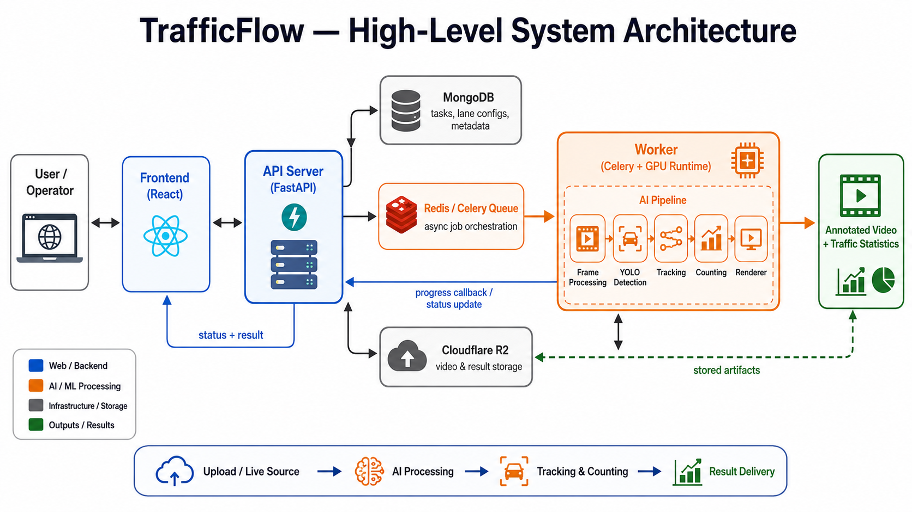
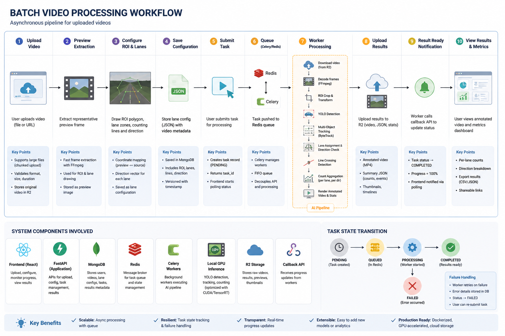
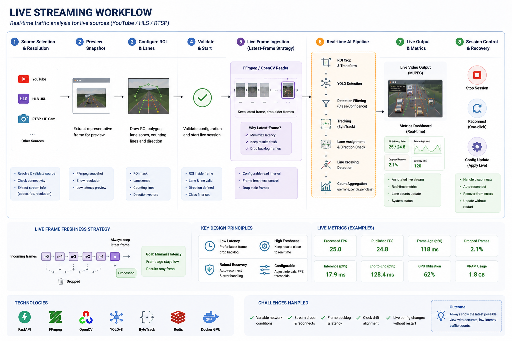
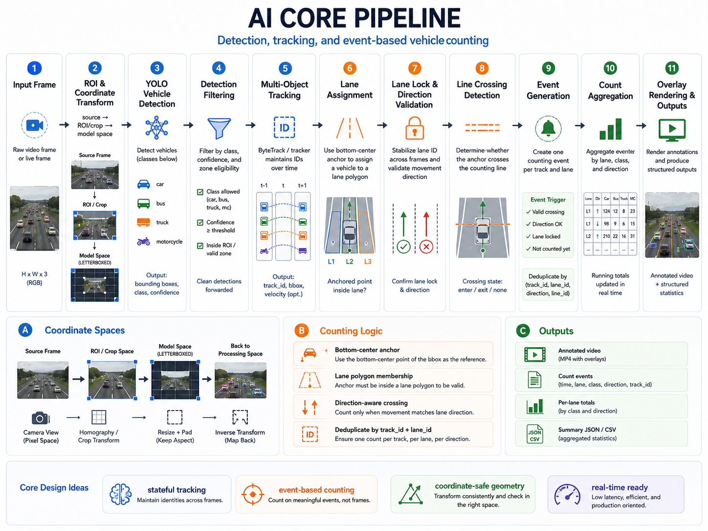
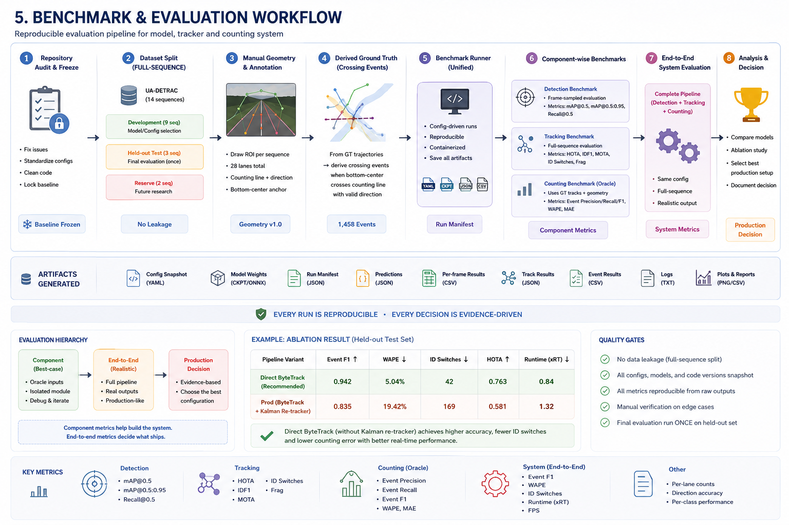
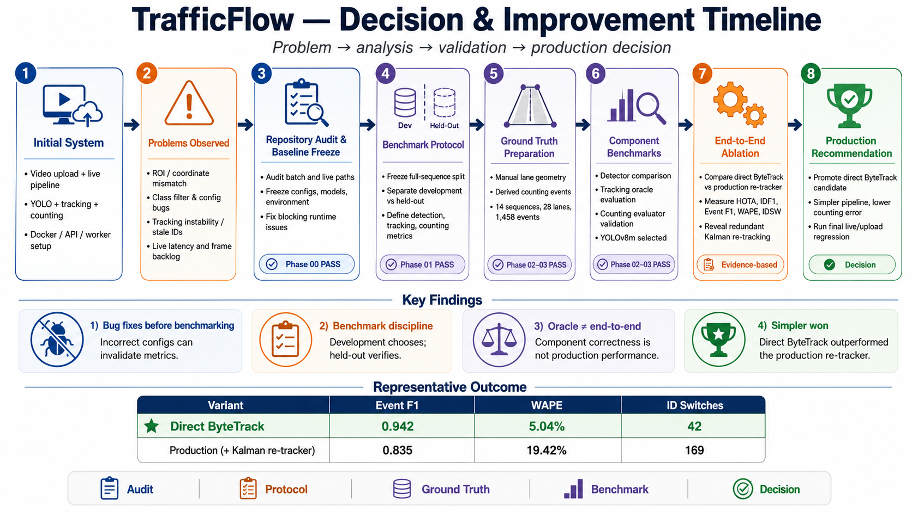

# TrafficFlow

Video-based traffic analysis for detecting, tracking, and counting vehicles by lane. Users can upload traffic videos or connect live sources (YouTube/HLS), draw monitoring regions, and receive an annotated video with vehicle statistics by lane, class, and direction.

This is a five-person project that runs natively with Node.js and Python on the local machine. Docker/Compose is not part of the project runtime.

---

## System Architecture



```text
User / Frontend
  → FastAPI API
    → MongoDB (tasks, configuration, and results)
    → Redis / Celery (processing queue)
      → Worker (video download and AI engine invocation)
        → Local GPU inference (YOLO + ByteTrack + counting)
          → Cloudflare R2 (result video storage)
            → Result delivered to the frontend
```

---

## Key Features

- **Traffic video upload** with chunked uploads for large files and automatic 1080p normalization
- **Live streaming** from YouTube, HLS, RTSP, or MJPEG with real-time analysis
- **Visual annotation** of ROIs, lanes, counting lines, and vehicle directions in the web interface
- **AI pipeline**: YOLO detection → ByteTrack tracking → lane filtering → line-crossing vehicle counting
- **Analytics dashboard** with vehicle counts by lane, class (car, bus, truck, motorcycle), and direction
- **Local GPU acceleration** through the Python environment; preflight clearly reports `BLOCKED` when CUDA or model weights are unavailable

---

## Workflow — Uploaded Video Processing



```text
Upload video → Extract a preview frame
  → User draws ROI, lanes, counting lines, and directions
    → Save lane configuration → Submit task
      → Celery queue → Worker downloads the video
        → Process each frame: Detect → Track → Count → Render
          → Upload the result to R2
            → Frontend polls for the annotated video and statistics
```

Processing is asynchronous and queue-based, so users do not need to wait in the browser. Results include an annotated video and detailed statistics for each lane.

---

## Workflow — Live Streaming



```text
YouTube / HLS / RTSP source
  → Resolve the source → Capture a preview snapshot
    → User draws ROI and lanes → Validate configuration
      → Start live session
        → FFmpeg latest-frame ingest
          → GPU inference → Tracking → Counting
            → MJPEG / live frame output → Real-time dashboard metrics
```

The live path differs from the batch path: it uses a latest-frame strategy that discards stale frames and always processes the newest frame, timestamp-aware tracking, and near-zero frame age.

---

## AI Pipeline



```text
Input frame
  → ROI crop + coordinate transform (normalize to crop-local coordinates)
  → YOLO detection (car, bus, truck, and motorcycle)
  → Detection filtering (class + confidence)
  → ByteTrack tracking (preserve vehicle identity across frames)
  → Lane assignment (assign vehicles using the valid zone)
  → Direction validation (compare vehicle direction with the direction vector)
  → Line-crossing detection (detect vehicles crossing the counting line)
  → Event generation (each crossing creates one counting event)
  → Count aggregation (lane + class + direction)
  → Overlay rendering (draw bounding boxes, track IDs, lanes, and counts)
```

**Key technical points:**

- **Bottom-center anchor**: uses the midpoint of the bounding box's bottom edge instead of its center to estimate vehicle position, which is closer to the road contact point
- **Lane lock**: each vehicle belongs to only one lane at a time to prevent duplicate counts
- **Direction-aware counting**: counts only vehicles moving in the configured direction and ignores opposing traffic
- **Event semantics**: each counting event contains `video_id`, `lane_id`, `class`, `direction`, `crossing_frame`, and `crossing_time`

Full details: [docs/current/architecture.md](docs/current/architecture.md)

---

## Benchmark & Evaluation



The benchmark process is evidence-driven:

```text
Audit repository → Freeze baseline → Freeze dataset split (by sequence, not frame)
  → Manual geometry → Derived ground truth (manual audit)
    → Unified benchmark runner
      → Detection benchmark (select a model)
      → Tracking benchmark (select a tracker)
      → Counting benchmark (measure end-to-end performance)
        → Production decision (select the optimal pipeline)
```

**Benchmark principles:**

- Freeze the held-out test set before tuning; never use test data to select a model
- Split by complete sequences; never split randomly by frame
- Record a run ID, configuration snapshot, and raw predictions for every metric so results are reproducible

### Main Results

*Benchmark on the held-out UA-DETRAC set using an RTX 5070 Ti GPU*

| Category | Metric | Result |
| --- | ---: | ---: |
| Vehicle detection | AP50 / Recall | 0.582 / 0.679 |
| Vehicle tracking | HOTA / IDF1 / ID Switch | 0.242 / 0.285 / 42 |
| Vehicle counting (event level) | Event F1 / WAPE | 0.942 / 5.04% |
| Uploaded video processing speed | FPS / Real-time factor | 75.8 FPS / 3.03× |
| Live stream (30-minute soak) | FPS / Frame age p95 / Drop | 14.9 FPS / 0.9 ms / 0% |

Operations documentation: [docs/current/](docs/current/)

---

## Timeline — Problem → Solution



Development across the main phases:

```text
Initial system (baseline)
  → ROI inconsistency issue (incorrect coordinate space)
    → Fix: coordinate normalization + geometry_space contract
      → Detection benchmark (select YOLOv8m)
        → Tracking ablation (compare direct ByteTrack with the production re-tracker)
          → Counting validation (derived ground truth + audit)
            → End-to-end comparison
              → Decision: Direct ByteTrack outperforms the production re-tracker
                → Live runtime optimization (latest-frame scheduling)
                  → 30-minute soak test → Stable 15 FPS
```

---

## Team & Roles

| Member | Role | Primary ownership |
| --- | --- | --- |
| Quang Nhật | AI Pipeline Engineer | Runtime engine, YOLO/ByteTrack inference, lane geometry, tracking, counting, benchmark, and evaluation |
| Công Phúc | Frontend Engineer | Upload UI, canvas lane drawing, coordinate scaling, progress, and result dashboard |
| Thái Hưng | Backend Engineer | FastAPI, database schema, upload/preview API, task/result APIs, data retention, and file validation |
| Minh Tiến | DevOps / Worker Engineer | Celery/Redis, worker, native process orchestration, GPU allocation, and environment configuration |
| Tuấn Hưng | Integration / QA / Release | End-to-end QA, coordinate alignment, queue stress testing, and release checklist |

---

## Technology Stack

| Layer | Technology |
| --- | --- |
| AI / CV | YOLOv8, YOLO11, ByteTrack, OpenCV 4.10, PyTorch, CUDA 12.4 |
| Backend | FastAPI, Celery, Redis, MongoDB Atlas |
| Frontend | React (Vite), HTML5 Canvas |
| Storage | Cloudflare R2 |
| DevOps | Node.js scripts, native Redis, NVIDIA runtime configuration |

---

## Quick Start — Native Local Runtime (No Docker)

```bash
cd TrafficFlow
cp .env.example .env
python3 -m venv .venv
npm run install:python
npm run install:frontend
npm run preflight
npm run dev
```

Open **http://127.0.0.1:8080** in a browser. The API runs at **http://127.0.0.1:8000**.

`npm run dev` starts the API and Vite frontend. The Celery worker starts only when native Redis is listening on `127.0.0.1:6379`; otherwise, the UI/API stack still runs but reports the worker as `BLOCKED`.

Minimum requirements: Node.js 20+, Python 3.10+, FFmpeg, and FFprobe. MongoDB is optional locally because a JSON fallback is available; Redis is required for batch processing. Local model weights plus `torch`/`ultralytics` are optional when `AI_SERVING_URL` is configured, because the worker falls back to remote inference.

Detailed native setup: **[docs/LOCAL_DEVELOPMENT.md](docs/LOCAL_DEVELOPMENT.md)**.

---

## Deploy the Frontend to Vercel

The repository is configured so Vercel builds only `frontend/`; the Python API and worker remain separate services. Follow [docs/VERCEL_FRONTEND_DEPLOYMENT.md](docs/VERCEL_FRONTEND_DEPLOYMENT.md) and set `VITE_API_BASE_URL` to the public HTTPS backend URL before deploying.

---

## Documentation

| Document | Contents |
| --- | --- |
| [docs/USER_GUIDE.md](docs/USER_GUIDE.md) | Detailed deployment and usage guide |
| [docs/VERCEL_FRONTEND_DEPLOYMENT.md](docs/VERCEL_FRONTEND_DEPLOYMENT.md) | Vercel frontend deployment |
| [docs/current/](docs/current/) | Current architecture and runbook |
| [docs/API_INTEGRATION.md](docs/API_INTEGRATION.md) | API, task state machine, and callbacks |
| [docs/contracts/](docs/contracts/) | API contracts, lane configuration, progress callbacks, and results |
| [benchmark/](benchmark/) | Detection, tracking, counting, and runtime benchmarks |

---

## Limitations & Future Work

**Current limitations:**

- The detection benchmark is sampled with a frame stride of 100 rather than exhaustive across all frames
- ROI crop accuracy has not been quantitatively benchmarked because crop ground truth is unavailable
- Live streaming currently measures stability only; no ground truth is available for counting accuracy
- UA-DETRAC has no motorcycle label, so motorcycle accuracy is not claimed
- Model weights, benchmark data, and credentials are not committed to the repository

**Next steps:**

- Manually label real-world videos to measure counting accuracy on live sources
- Automatically detect lanes instead of drawing them manually
- Support multiple cameras concurrently

---

*TrafficFlow — five-person team project, 2026*
